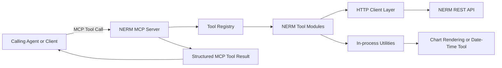
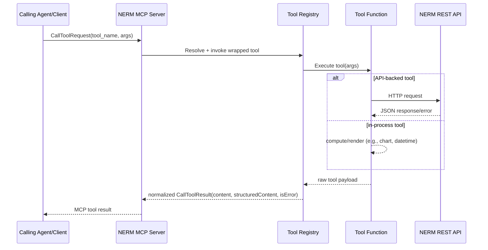
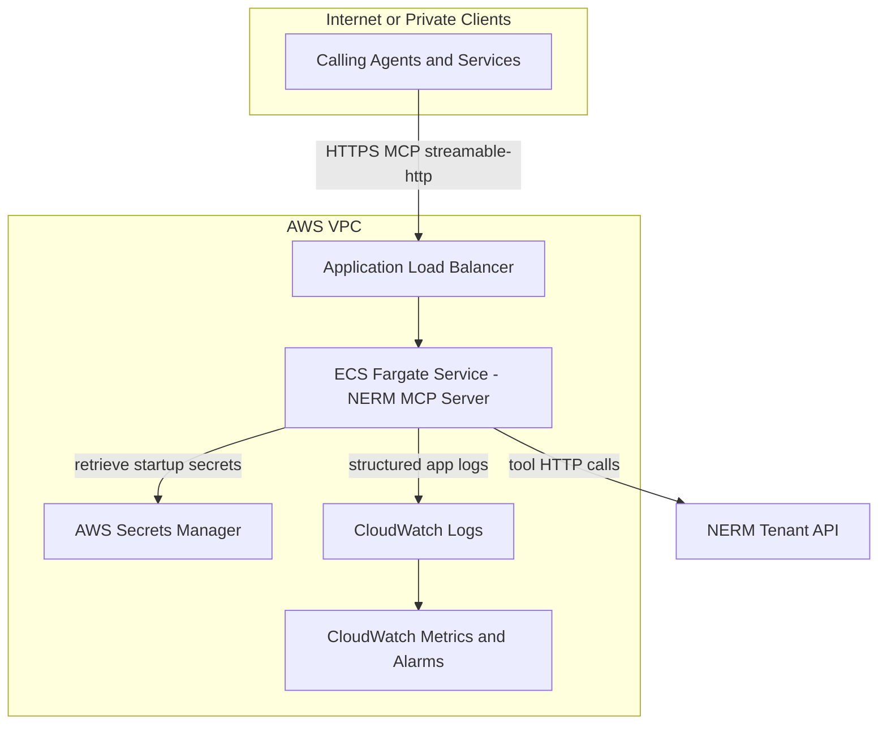

# NERM MCP Server

MCP-based administrative agent server for SailPoint Non-Employee Risk Management (NERM), designed to provide safe, structured tool access for profile, user, role, workflow, audit, and analytics operations.

## Purpose

This project provides a reusable **NERM capability service** that can be used by:

- interactive chat clients
- orchestrator agents
- other autonomous agents that need NERM operations as tools

Core goals:

- expose a consistent MCP tool interface for NERM administration
- enforce guardrails and validation (schema, pagination, error contracts)
- support multimodal outputs (for example chart image blocks)
- run locally and in production environments (including AWS)

## High-Level Architecture

At runtime, this project hosts an MCP server with registered NERM tools. The server can run over `stdio` (local subprocess) or `streamable-http` (network clients).




### Main Internal Components

- `nerm-mcp-server/app/main.py`: runtime entrypoint
- `nerm-mcp-server/app/nerm/server.py`: server bootstrap and transport selection
- `nerm-mcp-server/app/nerm/tools/registry.py`: tool registration and output normalization
- `nerm-mcp-server/app/nerm/tools/*.py`: domain tool implementations
- `nerm-mcp-server/app/Agent/system_prompt.txt`: operating guidance/guardrails

## System Prompt Summary

The MCP server exposes tools, and the bundled system prompt provides a strict operating policy for calling models:

- read-only by default; writes only on explicit user request
- profile-type-first routing for assignment/people/org-style intents
- mandatory use of constrained search patterns (avoid broad pulls)
- attribute discovery and type validation before advanced-search rules
- date-rule enforcement guidance (`after`/`before`, format from `neAttribute.date_format`)
- relationship mapping guidance (assignment/org/people links, sponsor mapping)
- safety controls (pagination circuit breaker, PII caution, workflow async messaging)
- output expectations (accurate totals, markdown tables, clear disambiguation)

## MCP Tools and Descriptions

### Profile Types and Profiles

- `nerm_list_profile_types`: list available profile types for ID resolution.
- `nerm_get_profile_type`: fetch one profile type by ID.
- `nerm_list_profiles`: list profiles with pagination and optional filters.
- `nerm_get_profile`: fetch one profile by ID.
- `nerm_run_advanced_search`: execute rule-based constrained profile search.

### Attributes and Identity Proofing

- `nerm_list_attributes`: list NERM attribute definitions and metadata.
- `nerm_get_attribute`: fetch one attribute definition by ID.
- `nerm_list_identity_proofing_results`: list identity proofing result records.

### Users and User Relationships

- `nerm_list_users`: list users with identity-oriented filter options.
- `nerm_get_user`: fetch one user by ID.
- `nerm_examine_jwt_user`: decode local invoke JWT claims for troubleshooting.
- `nerm_list_user_roles`: list user-to-role mappings (optionally enriched).
- `nerm_get_user_role`: fetch one user-role mapping by ID.
- `nerm_list_user_managers`: list user-manager relationship mappings.
- `nerm_get_user_manager`: fetch one user-manager mapping by ID.
- `nerm_list_user_profiles`: list user-to-profile relationship mappings.
- `nerm_get_user_profile`: fetch one user-profile mapping by ID.

### Roles and Role Relationships

- `nerm_list_roles`: list role records.
- `nerm_get_role`: fetch one role by ID.
- `nerm_list_role_profiles`: list role-to-profile relationship mappings.
- `nerm_get_role_profile`: fetch one role-profile mapping by ID.

### Delegations

- `nerm_list_delegations`: list delegation records.
- `nerm_get_delegation`: fetch one delegation by ID.
- `nerm_create_delegation`: create a delegation relationship.
- `nerm_update_delegation`: update an existing delegation.
- `nerm_delete_delegation`: delete a delegation.

### Workflows

- `nerm_list_workflow_sessions`: list workflow sessions.
- `nerm_get_workflow_session`: fetch one workflow session by ID.
- `nerm_list_workflow_session_statuses`: list/discover workflow status values.
- `nerm_add_location_via_workflow`: submit workflow to add location context.
- `nerm_add_department_via_workflow`: submit workflow to add department context.
- `nerm_add_organization_via_workflow`: submit workflow to add organization context.
- `nerm_get_job_status`: check async job status.

### Audit and Utility

- `nerm_query_audit_events`: query audit trail events with filter constraints.
- `nerm_generate_chart`: generate chart image output from provided numeric series.
- `nerm_get_current_date_time`: return current date/time, optionally by timezone.

## Usage Methods

### 1) Local `stdio` mode (best for local tool subprocess clients)

```bash
cd nerm-mcp-server
source .venv/bin/activate
export NERM_BASE_URL="https://tenant.example.com"
export NERM_API_BASE_PATH="/api"
export NERM_BEARER_TOKEN="Bearer eyJ..."
cd app
export NERM_TRANSPORT=stdio
python -m main
```

### 2) Local `streamable-http` mode (best for non-stdio clients)

```bash
cd nerm-mcp-server
source .venv/bin/activate
export NERM_BASE_URL="https://tenant.example.com"
export NERM_API_BASE_PATH="/api"
export NERM_BEARER_TOKEN="Bearer eyJ..."
cd app
export NERM_TRANSPORT=streamable-http
export NERM_HTTP_HOST=127.0.0.1
export NERM_HTTP_PORT=8080
python -m main
```

### 3) Containerized runtime

```bash
docker build -t nerm-agent:local .
docker run --rm --env-file nerm-mcp-server/.env nerm-agent:local
```

For deeper run/test details, see `nerm-mcp-server/README.md`.

### 4) Header-based tenant context (recommended for all non-stdio clients)

For local or remote agents using network transport (not stdio), prefer passing tenant
context in request headers per call rather than hard-coding tenant credentials in env.

Recommended per-request headers:

- `X-NERM-URL`: tenant base URL (for example `https://tenant.example.com/api`)
- `X-NERM-Authorization`: bearer token (for example `Bearer eyJ...`)

Behavior:

- calling agent sends tenant URL/token in headers
- server injects these values into tool calls when tool args do not explicitly provide them
- env vars remain a fallback/default path (for example stdio or temporary local debugging)

Benefits:

- one deployed MCP service can support multiple agents and multiple NERM tenants
- no service restart required to switch tenant context
- tenant scoping is explicit per request
- keeps the MCP server tenant-agnostic across local and remote non-stdio clients

Security notes for this mode:

- always run behind TLS
- authenticate calling agents at the edge/service boundary
- apply allowlisting/validation for inbound tenant URLs
- keep token redaction enabled in logs

## Data Flow

The MCP request/response path is intentionally strict and structured.




## AWS Reference Architecture (ECS + ALB + Secrets Manager + CloudWatch)

This is a concrete production-ready pattern for multi-agent consumption.

### Target Topology




### Deployment Steps

1. **Containerize and publish**
  - Build image from this repo.
  - Push to ECR.
2. **Store runtime secrets**
  - Put NERM credentials/config in Secrets Manager:
    - `NERM_BASE_URL`
    - `NERM_API_BASE_PATH`
    - `NERM_BEARER_TOKEN`
  - Grant ECS task role read access to only required secrets.
3. **Provision ECS Fargate service**
  - Run `nerm-mcp-server/app/main.py` with:
    - `NERM_TRANSPORT=streamable-http`
    - `NERM_HTTP_HOST=0.0.0.0`
    - `NERM_HTTP_PORT=8080`
  - Use private subnets and security groups with least privilege.
4. **Expose through ALB**
  - Create target group for ECS service.
  - Configure HTTPS listener and certificate (ACM).
  - Add health checks aligned to your service behavior.
5. **Add observability**
  - Send container logs to CloudWatch Logs.
  - Create CloudWatch alarms for:
    - 5xx rate
    - task restarts
    - latency spikes
    - error log pattern matches
6. **Harden access**
  - Restrict ingress to trusted agent callers.
  - Add auth at edge/service boundary (for example JWT or mTLS pattern).
  - Keep bearer tokens out of logs; rely on redaction and secret injection.
7. **Operationalize**
  - CI deploy pipeline to ECS (blue/green or rolling).
  - Post-deploy conformance smoke checks.
  - Version and track tool contract changes.

## Multi-Agent Interaction Model

In AWS, this service acts as a shared MCP capability endpoint:

- one or more orchestrator agents call this server as a tool provider
- each caller sends MCP tool calls over HTTP transport
- this server handles NERM API integration, validation, and standardized responses

This keeps NERM logic centralized while allowing many agents to reuse the same controlled interface.

## Project Status and Next Steps

Recommended next improvements for production:

- add explicit auth middleware contract for network transport
- add a deployment folder (`infra/`) with IaC templates (CDK/Terraform)
- add runbook links for incident handling and rollback

